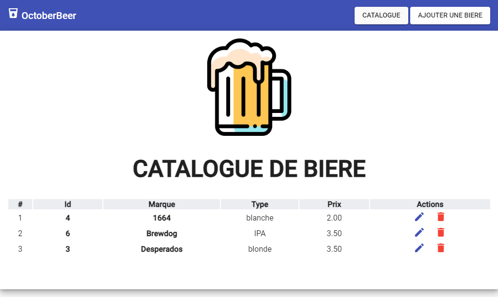

# docker-beer-II

## Introduction

OctoberBeer is an application designed for beer enthusiasts and brewers, facilitating the management of a beer catalogue. Developed with Angular and Node.js, it offers a basic user interface for adding, modifying, and managing beers. It's poised for further evolution



## Prerequisites

Operating Systems: Windows, macOS, Linux.
Software: Node.js (v14+), Docker, PostgreSQL.
Knowledge: Basics in Angular, Node.js, Docker, and PostgreSQL.

## Environment Setup

Node.js and NPM: Install Node.js and npm from nodejs.org.
Docker: Download Docker from docker.com.
PostgreSQL Database: Create a PostgreSQL database named `beer_catalogue`.

## Installation

Repository Cloning: `git clone https://github.com/your-repo/docker-beer-II.git.`
Dependencies Installation: Run `npm install` in the `/backend` and `/frontend ` directories.

## Environment Configuration
Flexible configuration of the application is achieved through the use of environment variables. These allow you to set important parameters without hardcoding sensitive values directly in the code or configuration files.

### Root .env File
At the root of the project, create a `.env` file for configuring the database used by Docker Compose:

POSTGRES_DB: The name of the PostgreSQL database.
POSTGRES_USER: The PostgreSQL database user.
POSTGRES_PASSWORD: The password for the PostgreSQL database.
Example:

dotenv
```
POSTGRES_DB=beer_catalogue
POSTGRES_USER=postgres
POSTGRES_PASSWORD=mySecurePassword
```

### Backend
In the /backend folder, create another .env file with the following variables:

`DB_HOST`: Host of the PostgreSQL database.
`DB_PORT`: Port of the PostgreSQL database.
`DB_USERNAME`: Username for the database.
`DB_PASSWORD`: Password for the database.
`DB_DATABASE`: Name of the database.
Example:

dotenv
```
DB_HOST=localhost
DB_PORT=5432
DB_USERNAME=postgres
DB_PASSWORD=mySecurePassword
DB_DATABASE=beer_catalogue
```

### Frontend
Environment variables for the frontend can be set in the `environment.ts` and `environment.prod.ts` for development and production environments, respectively.

### Docker Compose
In the `docker-compose.yml` file, use environment variables to configure services, such as database connection information for the backend service and server configurations for the frontend service.

Example:

yaml
```
services:
  backend:
    environment:
      - DB_HOST=postgres
      - DB_PORT=5432
      - DB_USERNAME=postgres
      - DB_PASSWORD=mySecurePassword
      - DB_DATABASE=beer_catalogue
  # other services...
```

Ensure never to include sensitive values directly in configuration files or source code, especially for public repositories.

## Démarrage rapide

Production :
```
npm run build
npm run start 
```

Development :
```
npm run dev
```

## Usage

User Interface: Navigate through the application to manage your beer collection.
API Endpoints: Use API endpoints to interact with the database.

## Tests

Running Tests: Launch `npm test` in the `/backend` folder to run tests.

## Déploiement

Docker : Utilisez `docker-compose up --build` pour déployer l'application en utilisant Docker.

## Contribution

Guidelines: Contributions are welcome. Please submit pull requests for any modifications.
Pull Requests: Ensure that tests pass and document any new features.

## Licence

The project is distributed under the ISC license.